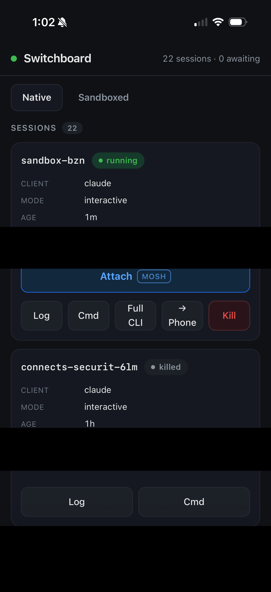
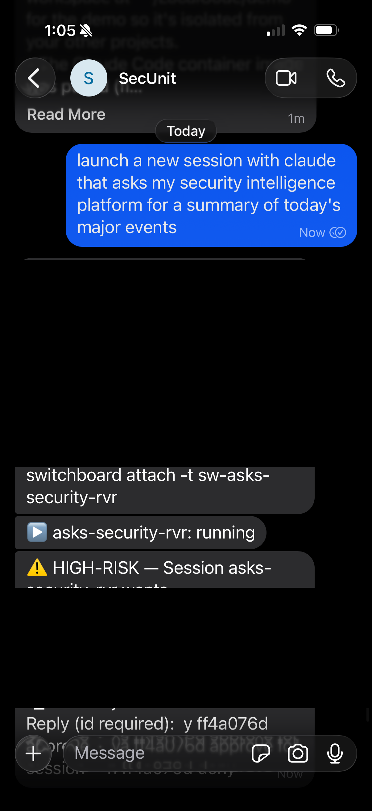
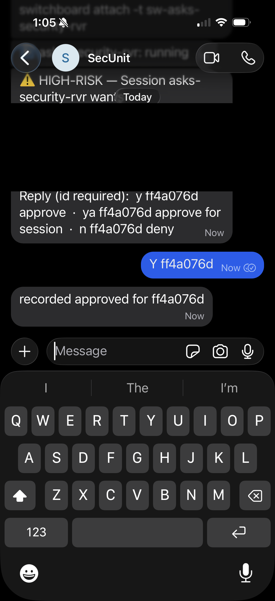
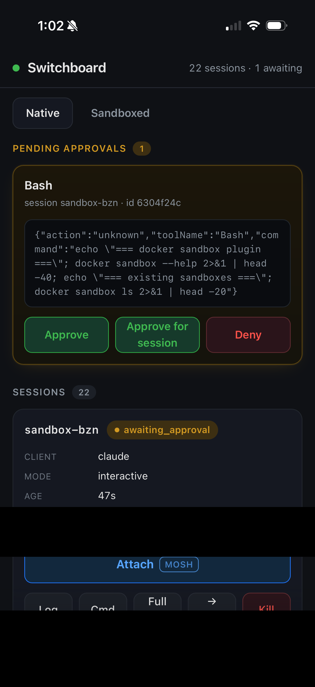
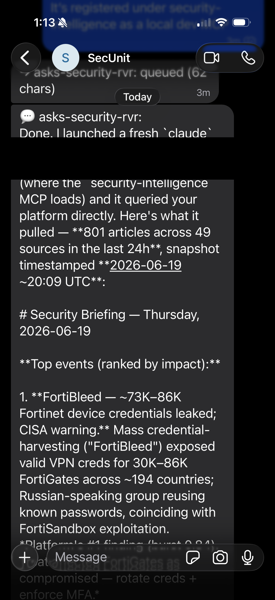
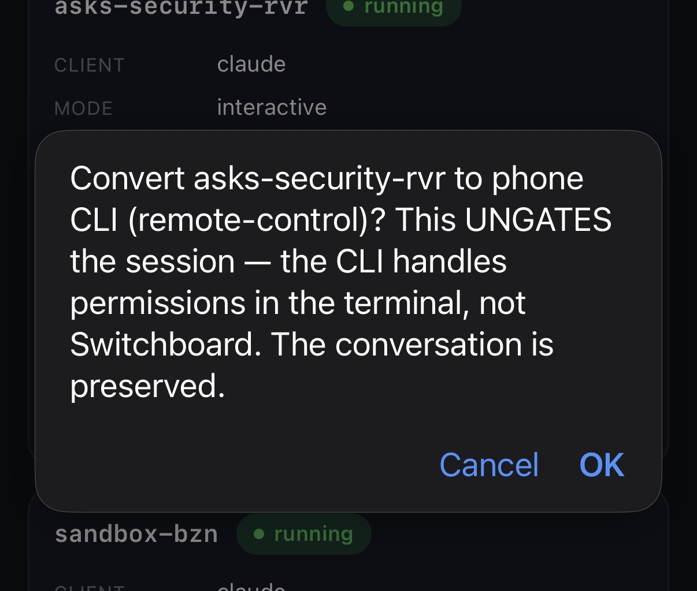
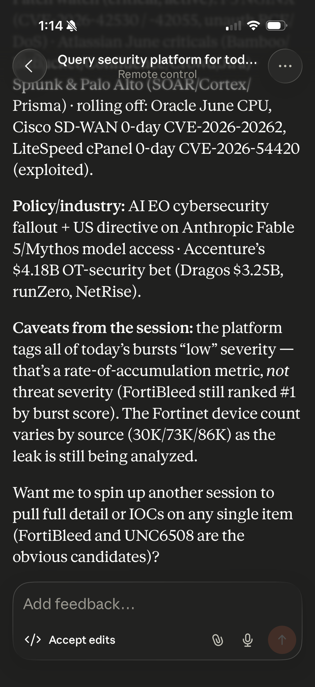
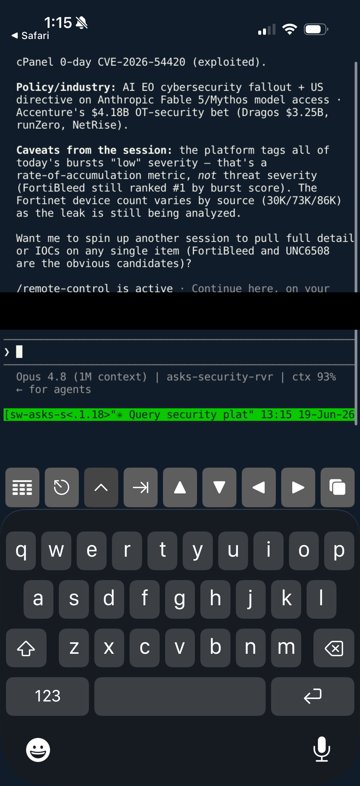

# Switchboard

> Self-hosted orchestrator for creating, managing, and coordinating **Claude Code**
> and **Codex** sessions remotely — while all execution stays on your own machine.

<p align="center">
  
</p>

Claude and Codex both support remote coding and interactions, but it hasn't been reliable or flexible enough for me. I want to start a session locally and transfer remotely, even when remote-control get flaky. I want to trigger a new session remotely, then pick it up when I'm back at my desk. I'm tired of thinking I set a job to run yet I come back and it hung on a permission request I didn't see. I don't want to run OpenClaw with full access to my system and MCP servers. Switchboard solves all of that (mostly). This tool probably won't be useful forever, but it's useful now.

It allows me to run multiple concurrent sessions, access and steer them from anywhere, keep them isolated from each other and limited to the built-in Claude and Codex sandboxes, and run fully sandboxed, untrusted sessions if I want (via IronCurtain integration). 

Switchboard fills the one niche no off-the-shelf surface covers: **local execution**
(so your local MCPs, local files, and non-repo code stay in scope) plus **async,
away-from-desk dispatch** (kick off and steer work from your phone over Signal), with
**per-task session isolation** so context never degrades into one sprawling conversation.

It drives the *official* `claude` and `codex` CLIs as subprocesses, each authenticating
under its own subscription. **Switchboard never touches, stores, or forwards an OAuth
token** — the first and most important of its security invariants.


## Example flows

* Start a session via signal "start a new claude session on my security-intelligence-platform project" then fully interact via Signal replies
* Approve/decline permission requests via the web dashboard or Signal
* 1-tap send the /remote-control command and switch to the Claude iOS app to steer the session
* 1-tap launch your terminal application of choice into a tmux session
* Connect to the tmux session from any authorized computer and move back to full keyboard
* Launch a local tmux session with "sbclaude" and take over control remotely from the dashboard
* Launch a local tmux session and steer all permissions/interactions through signal
* Swap around these various options during live sessions without restarting

| Start and steer over Signal | Approve over Signal | Approve from the dashboard | Results back in Signal |
|:---:|:---:|:---:|:---:|
|  |  |  |  |

| Swap a live session to phone | Pick up in the Claude app | Or any tmux terminal |
|:---:|:---:|:---:|
|  |  |  |

---

## What it does

Three session archetypes (§5.4):

| Archetype       | Lifetime   | Interaction                          | For                              |
|-----------------|------------|--------------------------------------|----------------------------------|
| **Deliverable** | Ephemeral  | Runs to completion, notifies you     | One-shot builds (e.g. a deck)    |
| **Interactive** | Long-lived | Attach via tmux / Signal / app       | Coding in a repo                 |
| **Coordinated** | Ephemeral  | Notifies on convergence              | Multi-agent implement/review     |

You text a vetted command to your dedicated Signal number; the dispatcher classifies it,
spawns the right session(s), and routes permission prompts back to you as `y/n` replies.
Interactive sessions are steerable three ways: **tmux attach** (console), **Signal relay**,
or **remote-control** via the official Claude/Codex apps.

The canonical coordinated task — *"Claude implements, Codex reviews, Claude decides"* —
runs a deterministic state machine where **only the decider can land changes**, enforced
by the executor, not trusted to an agent.

## Security invariants


1. **Official binaries only.** Drives the official CLIs; never extracts/stores/reuses OAuth tokens.
2. **Vetted input only.** Acts only on a hard-allowlisted Signal sender. Fetched/produced content is *data, never instruction.*
3. **Privileged but narrow coordinator.** The dispatcher spawns and routes; it never performs unattended destructive or broad-scope actions.
4. **Deterministic control flow over tainted output.** The model *plans*; *code* executes. Worker output can't redirect control flow or escalate authority.
5. **Curated memory writes.** Child sessions *propose*; only the dispatcher (or you) *promote*, with logged provenance.
6. **Append-only audit log.** Every consequential event is logged immutably (SQLite triggers, not convention). Never read back as instruction.
7. **Gated consequence + structural authority.** Consequential actions require explicit approval; in coordinated tasks only the *decider* can land, enforced by the executor.

The permission system runs every tool-use through a fail-closed policy under SDK isolation
(`settingSources: []`), so ambient `~/.claude` settings can never bypass it; an `ask`
decision blocks the tool until you approve out-of-band over Signal or the dashboard.

## Architecture

```
   Signal (you only) ──▶  CONTROL PLANE        signal-cli (hard allowlist) + Tailscale dashboard
   Tailscale dashboard ─▶
                          ORCHESTRATION PLANE   Dispatcher (headless Claude via Agent SDK):
                                                parse · classify · plan · spawn/route · curate · report
                          EXECUTION PLANE       Deliverable | Interactive | Coordinated
                                                        claude (SDK / CLI) · codex (CLI)
```

Substrate: a SQLite state store (sessions, coordination plans, append-only audit, approvals,
memory proposals) + curated markdown memory under the runtime home directory.

## Requirements

- **macOS** (daily-driver host; remote reach via Tailscale)
- **Node 26** — pinned via the committed `.nvmrc`/`.node-version`. `engines` is `>=22`, but
  26 is what's tested. (See *Prerequisites* for why the major version matters.)
- **`claude`** — Claude Code CLI, authenticated (Claude Max)
- **`tmux`**
- **`codex`** *(optional)* — Codex CLI, authenticated (ChatGPT Pro). Claude-only installs work
  without it, but it is **required for the `coordinate` flow** (Claude implements / Codex reviews).
- **`signal-cli`** *(for remote control)* — a Java tool (needs a JRE), registered to a dedicated number
- **Tailscale** *(for the remote dashboard/attach)*
- **Xcode Command Line Tools** + Python — for the native `better-sqlite3` build path (`xcode-select --install`)
- **`mosh`/`mosh-server`** — the default remote-attach transport

> **Optional: sandboxed execution backend.** Switchboard can also run sessions inside a
> Docker-sandboxed [IronCurtain](docs/IRONCURTAIN.md) backend. It is **experimental and
> off by default**, has its own extra prerequisites (Docker + the `ironcurtain` binary +
> Node 24), and is **not** part of the core requirements. See [docs/IRONCURTAIN.md](docs/IRONCURTAIN.md).

## Prerequisites

Beyond installing the tools above, two of them need accounts/numbers you have to *obtain*:

### A dedicated Signal number

Signal registration needs a **real phone number that is not your personal one**. Options:

- **Twilio** — buy a programmable number that can receive SMS, then read the inbound
  verification SMS in the Twilio console and pass that code to `signal-cli … verify`.
- **Google Voice** — a free second number (US).
- **A prepaid second SIM**.

Caveat: the number must be able to receive the SMS *or* voice verification code — Signal
rejects some VoIP numbers. Once you have a number, do the captcha → register → verify flow
(see *Setting up the remote control plane* below).

### Tailscale (host + phone on one tailnet)

1. Create a **Tailscale account**.
2. Install the Tailscale app on **both** the host Mac **and** your phone / remote device.
3. Sign **both** into the **same tailnet**.
4. Enable **MagicDNS** (so you get the `host.tailnet.ts.net` name) and either **Tailscale SSH**
   or a normal SSH server on the Mac.
5. Install **`mosh`** on the Mac (the default attach transport; `brew install mosh`).

Switchboard reaches the dashboard over `tailscale serve` (tailnet-only) — never a public
port, and **never `tailscale funnel`**.

### Local toolchain checklist

macOS · Node 26 (use the committed `.nvmrc`) · **Xcode Command Line Tools** + Python (for the
native `better-sqlite3` build path) · `git` · `tmux` · `mosh`/`mosh-server` · the `claude` CLI
(authenticated) · optionally the `codex` CLI (authenticated — **required** for `coordinate`,
optional for Claude-only installs) · `signal-cli` (a Java tool — needs a JRE).

## Install & quickstart

```bash
git clone https://github.com/rmogull/switchboard && cd switchboard
npm install
npm run build
npm link                             # puts the `switchboard` bin on your PATH

switchboard init                     # scaffold config + home/state dirs + state db
# edit switchboard.config.json (home, stateDir, Signal number, asset paths, repos)
switchboard doctor                   # validate config + check dependencies (incl. native module)
```

> The `switchboard` command exists only **after `npm run build` + `npm link`** (or a global
> install). Without that, invoke the built CLI directly as `node dist/cli/index.js …`. Pick
> one style and use it consistently — this README uses `switchboard …` throughout.

`init` writes the config **first** (mode `0600`, with a freshly generated dashboard token),
then creates the `home`/`stateDir` directories (mode `0700`) and the state DB. Everything
environment-specific lives in `switchboard.config.json` (gitignored), so the code carries no
personal data (see [`switchboard.config.example.json`](switchboard.config.example.json)).

> **Do not put `stateDir` inside an iCloud / Dropbox / Drive-synced folder.** It holds a live
> SQLite WAL database and git coordination scratch; sync managers corrupt or evict those
> files mid-write. Keep `stateDir` on a local, non-synced path (the example points it at
> `~/Library/Application Support/switchboard`).

## Setting up the remote control plane

1. **Register your dedicated Signal number** (the separate number from *Prerequisites*):
   ```bash
   # solve the captcha at https://signalcaptchas.org/registration/generate.html,
   # copy the signalcaptcha:// link, then:
   signal-cli -a +1XXXXXXXXXX register --captcha "signalcaptcha://..."
   signal-cli -a +1XXXXXXXXXX verify 123456   # the code arrives by SMS/voice to that number
   ```
   Set `signal.account` (this number), `signal.allowlist` (your personal number — the
   *only* sender allowed to command it), and `signal.enabled: true` in your config.
2. **Run the daemon** (kept alive by launchd):
   ```bash
   switchboard install-daemon   # or --render-only to inspect the plist first
   ```
3. **Expose the dashboard on your tailnet** by setting `tailscale.serve: true` (the
   daemon runs `tailscale serve` for you; it stays localhost-bound otherwise). **Never**
   `tailscale funnel` — that would put a full operator console on the public internet.

### Dashboard token (the control plane is authenticated)

The dashboard can kill sessions, decide approvals, and spawn sandboxed sessions — it is a
control plane, not a viewer.

- **`init` auto-generates `dashboard.token`** into your config.
- **Open it as `http://<host>:<port>/?token=<token>`.** `init` and `doctor` both print the
  exact URL with the token filled in. Every `/api` route requires the token (a request
  without it gets `401`).
- **It refuses to start exposed without a token.** Setting a non-loopback `bindAddress`
  *or* `tailscale.serve: true` with no token set is a startup error.
- **Any device on your tailnet that has the token is a full operator.** Treat the token like
  a root credential; it can kill sessions, decide approvals, and spawn sandboxed sessions.

## Attaching from a terminal (phone, tablet, or desktop)

`switchboard attach <id>` prints the exact `ssh`/`mosh` command for an interactive session
(the dashboard shows the same string to copy). The command is driven by the `attach` config
block:

- `attach.sshHost` — your Mac over the tailnet (e.g. `user@your-mac.your-tailnet.ts.net`).
  Unset → `attach` emits only a bare **local** tmux command.
- `attach.transport` — `mosh` (default; survives phone sleep/roaming) or `ssh` (for clients
  without mosh).
- `attach.moshServerPath` — absolute path to `mosh-server` on the Mac (injected into the
  connection string because a non-login SSH PATH usually omits Homebrew's bin).

Run that printed command in any terminal app that speaks ssh/mosh:

| Platform | App | Notes |
|----------|-----|-------|
| **iOS** | Blink | mosh **and** ssh — default `mosh` transport works. |
| **iOS** | Termius | ssh only — set `attach.transport: "ssh"`. |
| **iOS** | a-Shell | ssh/mosh from a local shell. |
| **iOS** | Panic Prompt | one-tap via the `attach.promptFavorite` deep link. |
| **Android** | Termux | mosh — default transport works. |
| **Android** | JuiceSSH | ssh only — set `attach.transport: "ssh"`. |
| **Desktop** | iTerm2 / Terminal / WezTerm | mosh or ssh. |
| **Desktop** | Windows Terminal | ssh only — set `attach.transport: "ssh"`. |

mosh-capable clients use the default `mosh` transport; ssh-only clients need
`attach.transport: "ssh"`.

## Command surface

```
switchboard init | doctor
switchboard spawn  --client claude|codex --mode deliverable|interactive|coordinated [--repo|--dir] [--task] [--control] [--sandbox]
switchboard list | kill <id> | attach <id>
switchboard coordinate --task <text> [--repo|--dir] [--max-iterations N]
switchboard memory  list | show [file] | promote <id> | reject <id> | propose ...
switchboard learn   list | promote <id> | rules
switchboard daemon | dashboard
switchboard install-daemon [--render-only|--dev] | uninstall-daemon | daemon-status
```

Over Signal you send natural-language commands, reply `y`/`n` to approvals, and
`promote <id>` to confirm an auto-allow suggestion.

## Configuration

Key fields in `switchboard.config.json` (gitignored):

- `home` — runtime home directory (working memory + skills root). Override with `SWITCHBOARD_HOME`.
- `stateDir` — operational state (DB, scratch, sessions, logs). Defaults to `<home>/switchboard`; keep it on a **local, non-synced** path (see the iCloud/Dropbox warning above).
- `signal.account` / `signal.allowlist` — the registered number, and the only senders allowed to command it.
- `clients.claude` / `clients.codex` — enable/disable and pin CLI paths.
- `assets` / `repos` — named template/asset paths and known repo locations.
- `policy` — overrides for the default permission matrix and a global egress allowlist.
- `approvals.timeoutMs` / `onTimeout` — how long a blocking tool call waits, and the fail-closed default.
- `dashboard.token` — bearer token required on every `/api` route (`init` generates it).
- `tailscale.serve` — expose the dashboard on the tailnet (via `tailscale serve`, never funnel).
- `attach.sshHost` / `attach.transport` / `attach.moshServerPath` — remote attach target and transport.

## Updating an existing install

```bash
git pull
npm ci
npm rebuild better-sqlite3   # only if you changed Node major versions since last build
npm run build
switchboard install-daemon   # re-render + reload the launchd agent
```

## Teardown

`switchboard uninstall-daemon` removes only the launchd plist (it stops the daemon). It does
**not** delete your data or undo external state. Clean these up separately:

- the **DB / `stateDir`** (your sessions, scratch, logs) and the **`home`** directory;
- the **`tailscale serve`** mapping (e.g. `tailscale serve --https=443 off`);
- the **`signal-cli` registration** for the dedicated number (unregister via `signal-cli`).

## Troubleshooting

- **`NODE_MODULE_VERSION` / "compiled against a different Node.js version".** `better-sqlite3`
  is a native module and its ABI is tied to the Node major you built against. Run
  `npm rebuild better-sqlite3` (and after **any** Node version switch). `switchboard doctor`
  detects this in its native-module preflight, prints this exact remedy, and exits non-zero
  instead of crashing. Node 20 has no prebuild, so it forces a from-source build that needs
  the Xcode Command Line Tools.
- **Daemon won't start / crash-loops.** Check `<stateDir>/logs/daemon.out.log` and
  `<stateDir>/logs/daemon.err.log`, and run `switchboard daemon-status`. launchd starts the
  daemon with a minimal `PATH`, so pin absolute binary paths in config (`clients.*.cliPath`,
  `tailscale.binPath`, `attach.moshServerPath`) when a tool isn't found.
- **`signal-cli` captcha / rate-limit failures.** Re-solve the captcha at
  `https://signalcaptchas.org/registration/generate.html` and retry `register`; Signal
  rate-limits registration, so wait before retrying. Confirm the dedicated number actually
  received the SMS/voice code (some VoIP numbers are rejected).
- **Dashboard returns `401`.** You opened it without the token. Use the full
  `http://<host>:<port>/?token=<token>` URL that `init`/`doctor` print.
- **Port already in use.** Another process holds the dashboard port — change `dashboard.port`
  (default `8765`) or free the port.

## Development

```bash
npm run typecheck    # tsc --noEmit
npm test             # vitest
npm run build        # tsup → dist/
```

See [SECURITY.md](SECURITY.md) for the threat model and [CONTRIBUTING.md](CONTRIBUTING.md)
for the dev workflow. The full design brief is in
[`specification/orchestrator-spec.md`](specification/orchestrator-spec.md).

## License

[Apache-2.0](LICENSE)
